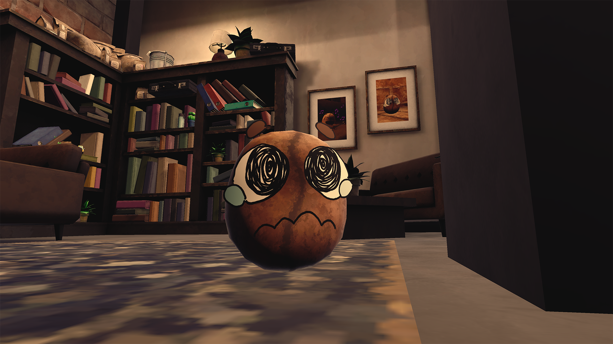
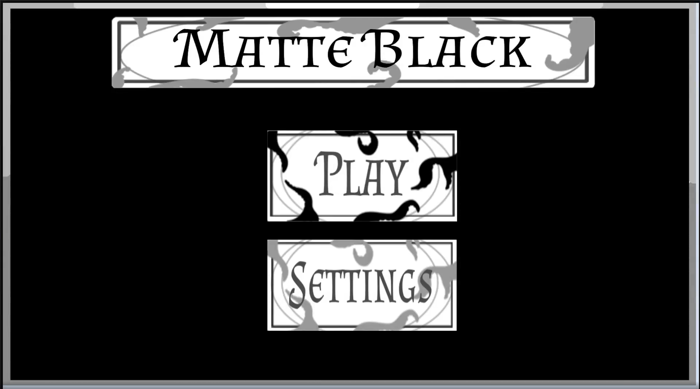
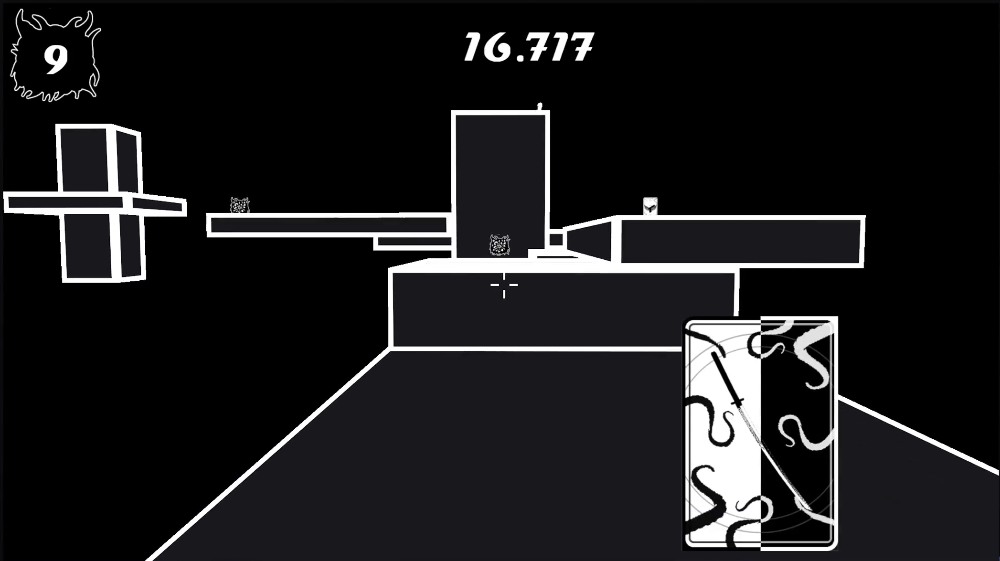
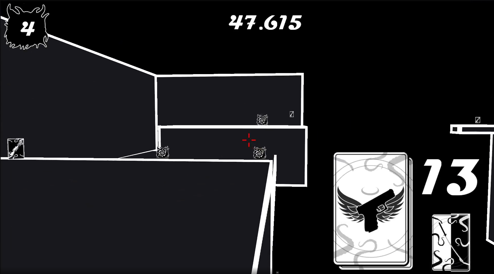
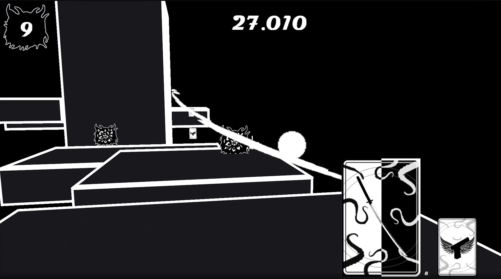
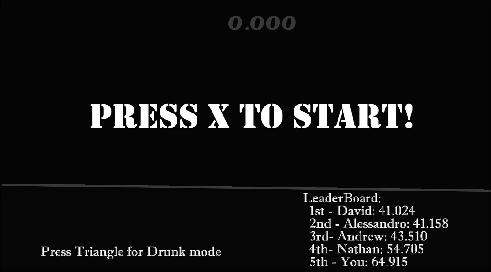
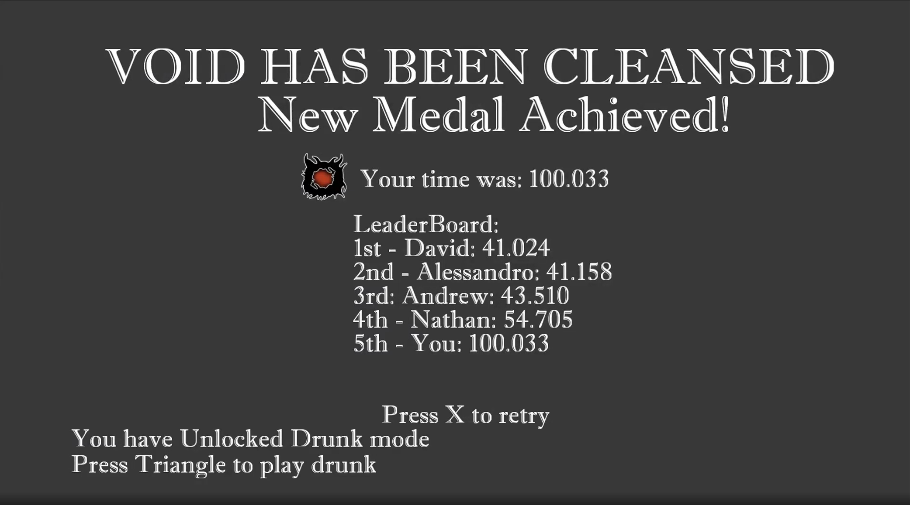
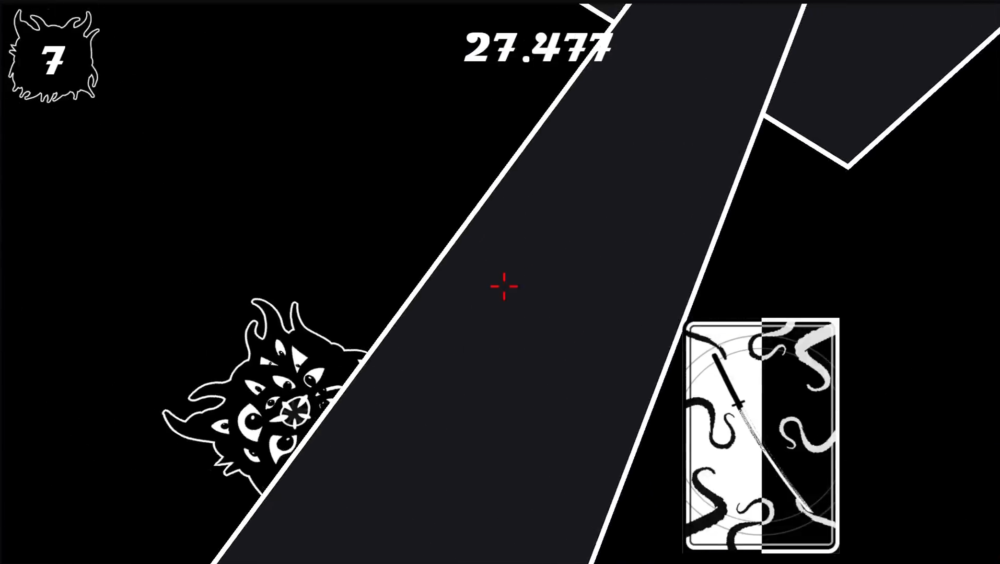

# andyandme.github.io
## Andrew Burt Portfolio

# Coffee, Run (2025 Q2)

  
  
  
  
  
  

Coffee Run is a group project I was involved in, as one of three programers.
My contripution was; all forms of interaction between bean - Coffee machine - customer window, all menu ui abd functionality, The basic core game loop, a Progression System (Day/next level system), Implemented almost all particle effects, I even added aditional Dificulty and more core gameplay with my addition of functioning syrups.

Itch Page: <a href="https://spectral-cat-dundee.itch.io/coffee-run" target="_blank" rel="noopener">Coffee Run — itch.io</a>

# Matte Black (2024 Q2)

  
  
  
  
  
  

Matte Black is a group project I was involved in, as one of four Programmers.
My Contripution was; Player Jumping logic, Card Powers implementation, Card Management, Players Death Logic, Player/Enemy Restart Logic, Leaderboard Logic and implementation, Bonus Drunk mode implemented, Card UI, Enemy Health UI, functional timer UI, Start and End game scenes implemented and functional, Sword slash UI implementation  

Etc.
TEST
