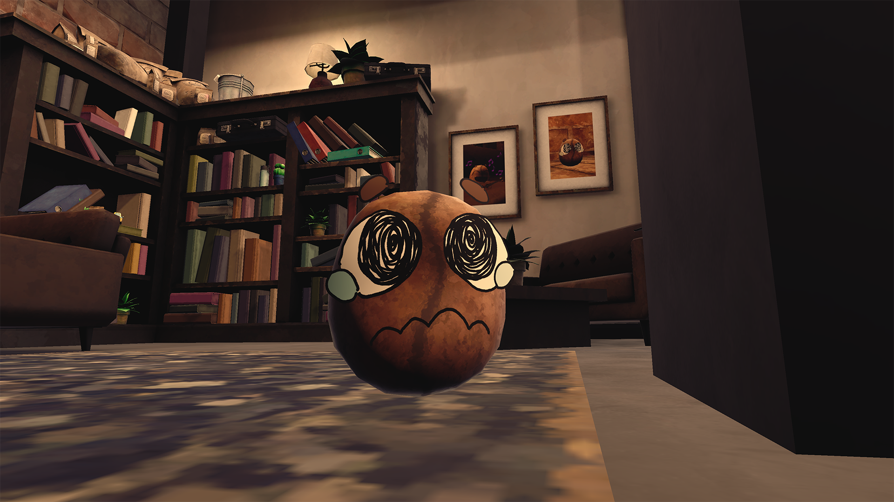

# andyandme.github.io
## Andrew Burt Portfolio

# Coffee, Run (2025 Q2)

Coffee Run is a group project I was involved in, as one of three programers.
My contripution was; all forms of interaction between bean - Coffee machine - customer window, all menu ui abd functionality, The basic core game loop, a Progression System (Day/next level system), Implemented almost all particle effects, I even added aditional Dificulty and more core gameplay with my addition of functioning syrups.

Itch Page: <a href="https://spectral-cat-dundee.itch.io/coffee-run" target="_blank" rel="noopener">Coffee Run — itch.io</a>

# Example 2
Example 2 Desc.

Etc.
TEST
